 

 

 

  
<code>// ▸ expand public telemetry</code>

   
  

    
  

 

  
<code>// ▸ expand private telemetry</code>

   
  

    
  

 

### `// CHANNELS`

| node | channel  | endpoint                                                                                       |
| ---- | -------- | ---------------------------------------------------------------------------------------------- |
| `01` | github   | [github.com/ArmandoBattaglino](https://github.com/ArmandoBattaglino)                           |
| `02` | linkedin | [linkedin.com/in/armando-battaglino](https://www.linkedin.com/in/armando-battaglino-7743ab295) |

 
 

<code>EOF // armando@workshop · the workshop never closes</code>

