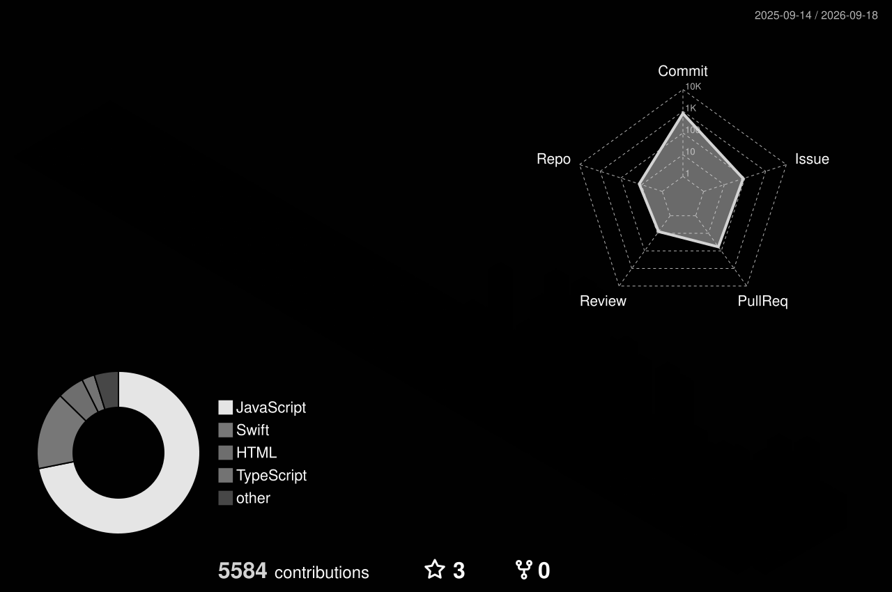
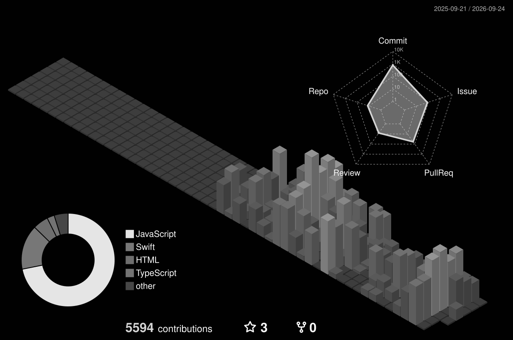
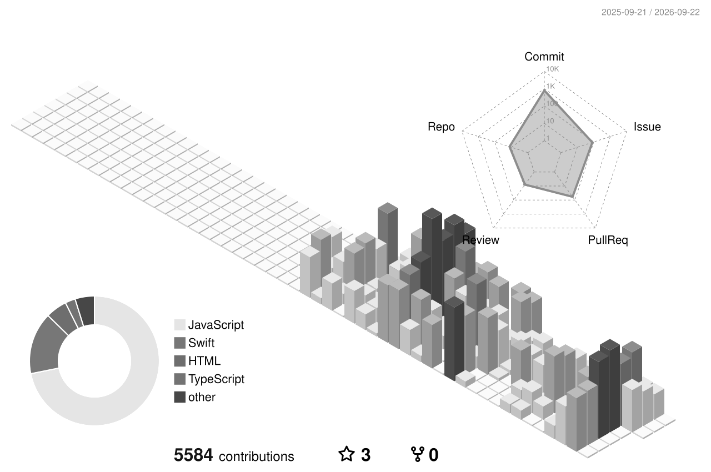
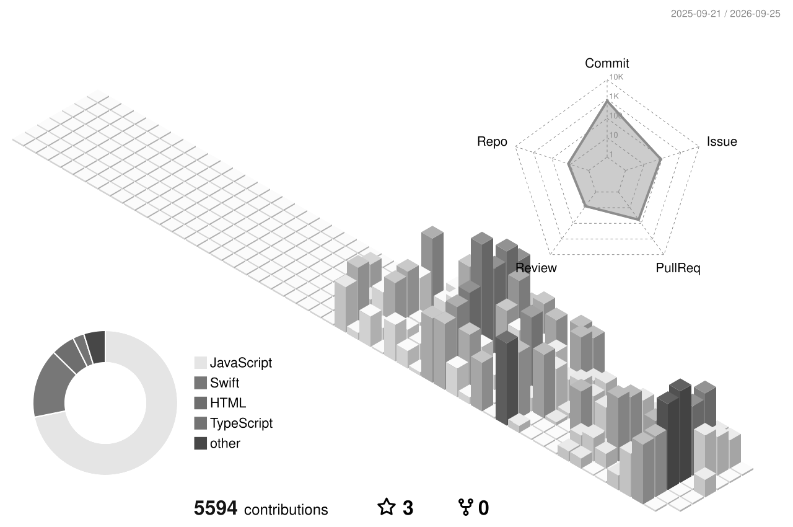

<!-- ╔════════════════════════════════════════════════════════════════╗ -->
<!-- ║              ARMANDO BATTAGLINO · GITHUB PROFILE               ║ -->
<!-- ╚════════════════════════════════════════════════════════════════╝ -->

<div align="center">


</div>

<br/>

<div align="center">

<a href="https://github.com/ArmandoBattaglino">
  
</a>

<br/><br/>

<a href="https://github.com/ArmandoBattaglino?tab=followers">
  
</a>


<a href="https://www.linkedin.com/in/armando-battaglino-7743ab295">
  
</a>

</div>

<br/>


## 🧬 &nbsp;Who am I?

```ts
const armando: Developer = {
  location:    "Italy 🇮🇹",
  pronouns:    "he/him",
  focus:       ["AI assistants", "Human-Computer Interaction", "Desktop & Mobile apps"],
  stack:       ["TypeScript", "Swift", "JavaScript", "Electron", "Python"],
  obsession:   "offline-first tools that respect your privacy",
  currentlyOn: ["Harness-Maker", "GIGI (AI-VPA)", "HandControl"],
  philosophy:  "ship · iterate · ship again",
  funFact:     "I talk to my computer more than to my dog 🐕",
};
```

<br/>


## ⚙️ &nbsp;Arsenal

<div align="center">

#### Languages


#### Frameworks & Tools


#### AI & ML


#### DevOps & Editors


</div>

<br/>


## 🌌 &nbsp;A year of contributions, in 3D

<div align="center">

<picture>
  <source media="(prefers-color-scheme: dark)" srcset="./profile-3d-contrib/profile-night-rainbow.svg" />
  <source media="(prefers-color-scheme: light)" srcset="./profile-3d-contrib/profile-green-animate.svg" />
  
</picture>

<sub>🎨 <i>Each tower = one day. Higher = more commits. Generated daily by GitHub Actions.</i></sub>

</div>

<br/>


## 📊 &nbsp;Live stats

<div align="center">

<a href="https://github.com/anuraghazra/github-readme-stats">
  
  
</a>

<br/><br/>

<a href="https://git.io/streak-stats">
  
</a>

</div>

<br/>


## 🏆 &nbsp;Trophies unlocked

<div align="center">

<a href="https://github.com/ryo-ma/github-profile-trophy">
  
</a>

</div>

<br/>


## 🐍 &nbsp;Watch the snake eat my contributions

<div align="center">

<picture>
  <source media="(prefers-color-scheme: dark)" srcset="https://raw.githubusercontent.com/ArmandoBattaglino/ArmandoBattaglino/output/github-snake-dark.svg" />
  <source media="(prefers-color-scheme: light)" srcset="https://raw.githubusercontent.com/ArmandoBattaglino/ArmandoBattaglino/output/github-snake.svg" />
  
</picture>

</div>

<br/>


## 🚀 &nbsp;Featured projects

<div align="center">

<a href="https://github.com/ArmandoBattaglino/Harness-Maker">
  
</a>
<a href="https://github.com/Building-addicts/GIGI">
  
</a>

<a href="https://github.com/ArmandoBattaglino/HandControl">
  
</a>

</div>

<br/>

<details>
  <summary><b>🎯 &nbsp;What each one does</b></summary>
  <br/>
  <table>
    <tr>
      <td><b>🛠 Harness-Maker</b></td>
      <td>JavaScript toolkit for building and configuring agent harnesses.</td>
    </tr>
    <tr>
      <td><b>🤖 GIGI</b></td>
      <td>Swift AI-VPA — "kill Siri, push GIGI". Native Apple voice assistant done right.</td>
    </tr>
    <tr>
      <td><b>✋ HandControl</b></td>
      <td>Windows desktop app — control your PC with webcam hand gestures + IT/EN voice dictation. Electron + MediaPipe + Whisper. Fully offline.</td>
    </tr>
  </table>
</details>

<br/>


## 🔍 &nbsp;Deeper insights

<details>
  <summary><b>📈 &nbsp;Profile summary cards (click to expand)</b></summary>
  <br/>
  <div align="center">
    
    
    
    
    
  </div>
</details>

<details>
  <summary><b>🎨 &nbsp;Alternative 3D themes</b></summary>
  <br/>
  <div align="center">
    
    
    
    
  </div>
</details>

<br/>


## 💬 &nbsp;Words to code by

<div align="center">

[](https://github.com/piyushsuthar/github-readme-quotes)

</div>

<br/>


## 🌍 &nbsp;Let's build something together

<div align="center">

<a href="https://www.linkedin.com/in/armando-battaglino-7743ab295">
  
</a>
<a href="https://github.com/ArmandoBattaglino">
  
</a>
<a href="mailto:efactorygroupsrl@gmail.com">
  
</a>

<br/><br/>

<sub>💡 <i>Open to collaboration on AI · HCI · desktop tools · anything that pushes a boundary.</i></sub>

</div>

<br/>

<div align="center">


<sub>⭐ <i>Thanks for stopping by — now go build something weird today.</i> ⭐</sub>

<br/><br/>


</div>
